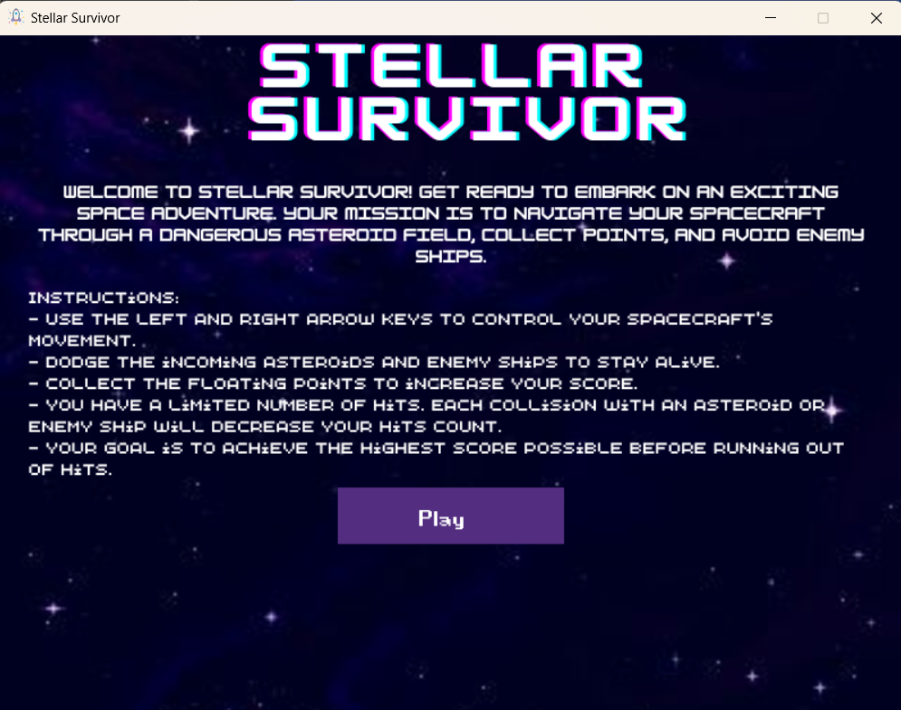
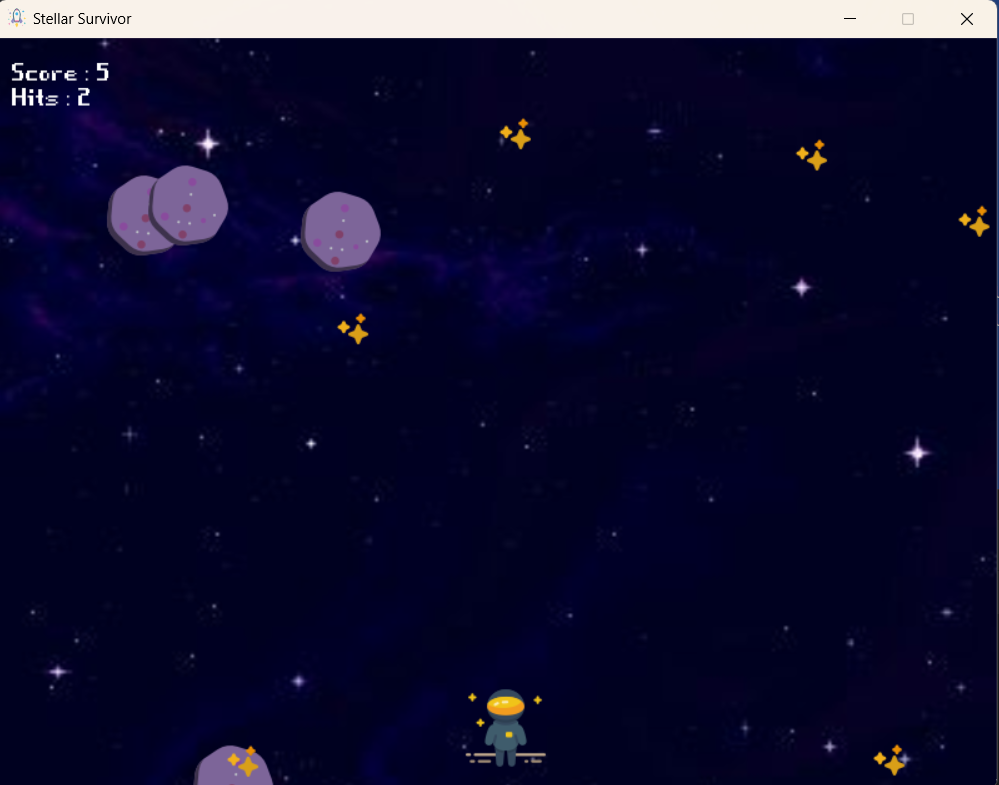

# Stellar Survivor

## Game Play

Welcome to Stellar Survivor! This is a simple game created using Pygame, where you control a spaceship to avoid enemies and collect points. Test your reflexes and see how far you can survive in space!

## Table of Contents

- [Introduction](#introduction)
- [Installation](#installation)
- [How to Play](#how-to-play)
- [Controls](#controls)
- [Gameplay](#gameplay)

## Introduction

Stellar Survivor is a casual game that challenges players to maneuver a spaceship through a field of enemies while collecting points. The game is designed to be easy to pick up and play, making it suitable for players of all ages.

## Installation

1. Clone or download the game repository to your local machine.
2. Make sure you have Python 3.x installed on your system.
3. Install the required dependencies using the following command: pip install pygame
4. Run the game by executing the `main.py` file.

## How to Play

Launch the game and control the spaceship using the left and right arrow keys. Your goal is to avoid colliding with the enemy spaceships while collecting points to increase your score. The game ends when you run out of hit points.

## Controls

- Left Arrow Key: Move spaceship left
- Right Arrow Key: Move spaceship right

## Gameplay

- Avoid enemy spaceships to prevent losing hit points.
- Collect points to increase your score.
- The game ends when your hit points reach zero.

## Play the deployed version
[Play Game](https://replit.com/@sivani-l-r/Stellar-Survivor-A-PyGame?v=1)

